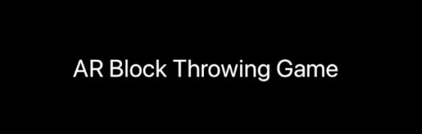

# New-AR-Game
This is a repository of a group project for the course "Software Project II"

<div id="top"></div>

<!-- PROJECT SHIELDS -->
<!--
*** I'm using markdown "reference style" links for readability.
*** Reference links are enclosed in brackets [ ] instead of parentheses ( ).
*** See the bottom of this document for the declaration of the reference variables
*** for contributors-url, forks-url, etc. This is an optional, concise syntax you may use.
*** https://www.markdownguide.org/basic-syntax/#reference-style-links
-->
[![Contributors][contributors-shield]][contributors-url]
[![Forks][forks-shield]][forks-url]
[![Stargazers][stars-shield]][stars-url]
[![Issues][issues-shield]][issues-url]
[![MIT License][license-shield]][license-url]


<!-- PROJECT LOGO -->
<br />
<div align="center">
  <a href="https://github.com/AR-Game-Project-KHEEEN/New-AR-Game">
    
  </a>

<h3 align="center">AR Block Throwing Game</h3>

  <p align="center">
    AR Game Project by AR-Game-Project-KHEEEN <br/>
    A Student Group Project of Haaga-Helia University of Applied Sciences <br/>
    Made with Viro React <br/>
  </p>
</div>


<!-- TABLE OF CONTENTS -->
<details>
  <summary>Table of Contents</summary>
  <ol>
    <li>
      <a href="#about-the-project">About The Project</a>
      <ul>
        <li><a href="#how-to-play">How to Play</a></li>
        <li><a href="#built-with">Built With</a></li>
      </ul>
    </li>
    <li>
      <a href="#getting-started">Getting Started</a>
      <ul>
        <li><a href="#prerequisites">Prerequisites</a></li>
        <li><a href="#installation">Installation</a></li>
      </ul>
    </li>
    <li><a href="#license">License</a></li>
    <li><a href="#authors">Authors</a></li>
  </ol>
</details>


<!-- ABOUT THE PROJECT -->
## About The Project


<p>The game is called AR Block Throwing Game. It was inspired by finnish outdoors game called "Mölkky".</br>
This is an augmented reality game where you throw one wooden block at other wooden blocks to knock them down and get points.</br></br>
You play the game through your phones camera view.</p>

### How to Play
* Moving the wooden block:
  * Hold the block with your finger and move it in your direction
* Throwing the wooden block:
  * While holding the block, swipe your finger and release it   
* Picking up the wooden block:
  * Hold the block with your finger and move it in your direction
  * IF THE BLOCK GETS STUCK IN THE DISTANCE, MOVE IT SLOWLY UP AND DOWN  

### Built With

* [React.js](https://reactjs.org/)
* [ViroMedia](https://viromedia.com/)


<!-- GETTING STARTED -->
## Getting Started

Game operates on Android and iOS devices.

### Installation

1. Install if you don't already have Node, Python2 (https://www.python.org/downloads/) and JDK
2. Install React Native CLI
   ```sh
   npm install -g react-native-cli
   ```
3. Install ViroMedia app to your phone
   ```sh
   https://play.google.com/store/apps/details?id=com.viromedia.viromedia&hl=fi&gl=US
   
   or
   
   https://apps.apple.com/us/app/viro-media/id1163100576
   ```
4. Clone this repository to your PC
   ```sh
   https://github.com/AR-Game-Project-KHEEEN/New-AR-Game
   ```
5. Install the necessary modules
   ```sh
   npm install
   ```

6. Start the program
   ```sh
   npm start
   ```
  Connect your phone to the same WiFi with your PC</br>
  Start the ViroMedia in your phone</br>
  Choose </> Enter Testbed in the menu from top left corner</br>
  Enter your computers IPv4-address</br>
  Press Go</br>

### Known issues in installation:
<br/>
<b>Installation Issue #1:</b>
<br/>
<br/>
If you get this error: 
<br/>
<br/>
<a>
    
</a>
<br/>
1. Go to the following file: <i>node_modules/metro-config/src/defaults/blacklist.js</i>
<br/>
<br/>
2. Change row 14 in var sharedBlackList into the following: 
<br/>
<br/>

```sh
 var sharedBlacklist = [   

  /node_modules[\/\\]react[\/\\]dist[\/\\].*/, 

  /website\/node_modules\/.*/, 

  /heapCapture\/bundle\.js/, 

  /.*\/__tests__\/.*/ 

  ];
```

<a>
    
</a>
After that restart the program with npm start.
<br/>
<br/>
<br/>

<b>Installation Issue #2:</b>
<br/>
<br/>
If you get this error:
<br/>

```sh
error: Error: Unable to resolve module fbjs/lib/invariant from C:\ViroSample\node_modules\react-viro\components\Material\ViroMaterials.js: fbjs/lib/invariant could not be found within the project or in these directories: 

  node_modules 

  ..\node_modules
```

<br/>
You need to install fbjs: 
<br/>
<br/>

```sh
npm install fbjs
```
<br/>
After that you might get this error:
<br/>
<br/>

```sh
error: Error: Unable to resolve module create-react-class from C:\ViroSample\node_modules\react-viro\components\ViroMaterialVideo.js: create-react-class could not be found within the project or in these directories: 

  node_modules 

  ..\node_modules 
```
<br/>

You need to install create-react-class:
<br/>

  ```sh
  npm install create-react-class
  ```

<br/>
<br/>
<b>Installation Issue #3:</b>
<br/>
<br/>
If you get this error:
<br/>
<br/>

```sh
Console.error: React Native version mismatch. 

JavaScript version: 0.65.1 

Native version: 0.59.9 
```

<br/>
Go to package.json and in dependencies-table change "react-native" -version to "^0.59.3"

<br/>
<br/>
<br/>

If you still get an error about not being able to connect to Node server: 
<br/>

```sh
Failed to load bundle, could not connect to development server
```
<br/>
Check your firewall settings. Choose "Allow an app through firewall". Press Change Setup and press check on every thing that reads Node.js: Server-side Javascript.

<br/>
<br/>
<br/>
<b>Installation Issue #4:</b>
<br/>
<br/>
If you get the following error: 
<br/>
<br/>

```sh
“Error connecting to package server”
```
<br/>
Double check that your phone and computer are in the same wifi.
<br/>
<br/>


<!-- LICENSE -->
## License

Distributed under the MIT License. See `LICENSE.txt` for more information.


<!-- AUTHORS -->
## Authors

* [Alhroth Kasper](https://github.com/kasperahlroth)
* [Friman Henry](https://github.com/hffriman)
* [Haikka Essi](https://github.com/haikess)
* [Heikonen Emilia](https://github.com/emiliaheikonenkoulu)
* [Ruuska Eetu](https://github.com/eeturuus)
* [Rytkönen Noora](https://github.com/NooraRytkonen)


<!-- MARKDOWN LINKS & IMAGES -->
<!-- https://www.markdownguide.org/basic-syntax/#reference-style-links -->
[contributors-shield]: https://img.shields.io/github/contributors/AR-Game-Project-KHEEEN/New-AR-Game.svg?style=for-the-badge
[contributors-url]: https://github.com/AR-Game-Project-KHEEEN/New-AR-Game/graphs/contributors
[forks-shield]: https://img.shields.io/github/forks/AR-Game-Project-KHEEEN/New-AR-Game.svg?style=for-the-badge
[forks-url]: https://github.com/AR-Game-Project-KHEEEN/New-AR-Game/network/members
[stars-shield]: https://img.shields.io/github/stars/AR-Game-Project-KHEEEN/New-AR-Game.svg?style=for-the-badge
[stars-url]: https://github.com/AR-Game-Project-KHEEEN/New-AR-Game/stargazers
[issues-shield]: https://img.shields.io/github/issues/AR-Game-Project-KHEEEN/New-AR-Game.svg?style=for-the-badge
[issues-url]: https://github.com/AR-Game-Project-KHEEEN/New-AR-Game/issues
[license-shield]: https://img.shields.io/github/license/AR-Game-Project-KHEEEN/New-AR-Game.svg?style=for-the-badge
[license-url]: https://github.com/AR-Game-Project-KHEEEN/New-AR-Game/blob/master/LICENSE.txt
[product-screenshot]: images/screenshot.png
